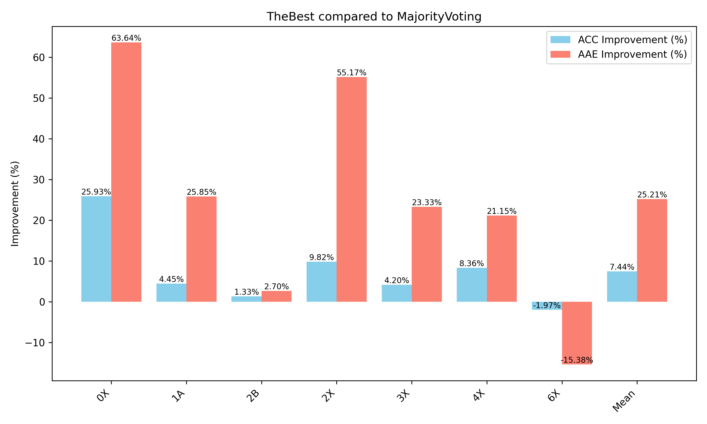

# 实验报告：基于 Deepseek API 的自动作业批改框架研究

**实验人**：冯志远、燕山楠

---

## 一、引言

在现代教育领域，随着自然语言处理（Natural Language Processing, NLP）和大规模预训练模型（Large Language Model, LLM）的快速发展，自动化批改作业的需求日益突出。教师在面对大量学生作业时，亟需高效、客观的自动批改工具。为此，我们基于 Deepseek API 提出了一套自动化作业批改框架。该框架在保留一定灵活度和准确度的同时，极大提升了教师的工作效率。

本报告将详细介绍此自动批改框架的整体设计思路、关键技术、实验流程和结果，并结合部分核心代码实现来阐述如何在实践中落地该方案。

---

## 二、整体设计思路

### 2.1 两阶段打分流程

1. **第一阶段打分**  
   - 首先对学生答案进行多线程并发评估，生成多个初步打分结果。  
   - 若模型生成的回答存在**严重格式错误**（如丢失必要字段、无法正确解析等情况），则直接排除该条结果，不纳入后续评判。  
   - 若所有评分规则（rules）均判定为 0 分，即不存在任何可取之处，则进入第二阶段打分。  
   - 在对多个评估结果进行综合后，采用以下三种方案之一来选定第一阶段的**最终得分**：
     1. **投票方案**  
        通过比较多个打分结果，选择得分结果最为一致的那个作为**最终得分**。若有多数票倾向于某个分值，则取该分值；若出现分票不均，则可根据业务策略（如取平均、进一步复核等）做额外处理。  
     2. **最高分方案（固定 One-Shot）**  
        依旧多线程并发生成多个打分结果，但最终取**最高分**作为第一阶段的**最终得分**。为增强打分准确性，此方案在调用大模型打分时，会在 Prompt 中使用一个**固定的 One-Shot 示例**（例如一个针对某类题目的标准答题-打分示例），让模型进行类比打分。  
     3. **最高分方案（动态检索 One-Shot）**  
        同样多线程并发生成多个打分结果，并最终取**最高分**作为第一阶段的**最终得分**。不过此方案会在一个**One-Shot 数据库**中检索与当前题目或学生答案最相似的示例，动态选取合适的 One-Shot 示例给模型参考。这种方法可以让打分参考的示例更有针对性，相关性更高。  
     > **注**：方案二与方案三的详细实现及对比可参见 [3.4](#34-one-shot-策略) 的说明。  
   
2. **第二阶段打分**  
   - 当第一阶段的结果为 0 分时，说明暂未识别出学生答案中任何有价值的部分。  
   - 此时需要再次审阅答案，重点关注是否存在**部分正确**或**有价值的思路**。  
   - 若在本轮审阅中发现此前忽视的正确内容，则给予相应的部分分；若依旧无可取之处，则维持 0 分。

### 2.2 RAG（Retrieval-Augmented Generation） 技术

为提升模型在**组合数学**领域的专业性和回答准确度，我们在进行打分前采用了 RAG 技术，从《组合数学》文献中检索最相关的 4 个文本片段（chunk），再将其与 Prompt 一并输入模型，过程如下所示：

```python
# 此处仅作示意性展示
# 假设已将“组合数学”文本切分并向量化存入DB
# 使用 text2vec-large-chinese 模型作为向量生成器

# 1. 将小问题转为向量
question_vector = encoder.encode(question_text)

# 2. 检索相似度最高的top 4个chunk
top_chunks = vector_db.search(question_vector, top_k=4)

# 3. 组合这些chunk内容，并融入到prompt当中
context_text = "\n".join(top_chunks)
```

在此基础上进行打分时，模型可访问更完备的**组合数学**专业知识背景，有效降低错误评判的概率。该做法与前述两阶段打分流程结合，能够进一步提高答案评估的精准度。 


---

## 三、关键技术与实现

### 3.1 Deepseek API 与 Prompt 设计

- **Deepseek API**：核心用于调用大型语言模型，完成对学生答案的理解与打分。  
- **System Prompt**：将模型设定为“勤勉而谨慎的数学批改助教”，确保回答具备较高的专业度与可信度。  
- **One-Shot 示例 + Chain-of-Thought**：在 Prompt 中展示一个典型打分示例，引导模型根据评分规则进行多步骤的推理与对比分析，以便输出更细腻的结果。

### 3.2 多线程并行与投票机制

为提高**时间效率**与**打分稳定性**，我们在第一阶段打分时采用了**多线程并发**生成多个响应，并对它们进行投票表决。下方为核心代码片段示例（已做简化）：

```python
with concurrent.futures.ThreadPoolExecutor(max_workers=4) as executor:
    # Submit each model call as a separate future
    future_list = [
        executor.submit(openai_completion, **inputs)
        for _ in range(num_responses)
    ]
    
    # Collect the results as they complete
    for future in concurrent.futures.as_completed(future_list):
        response = future.result()
        # parse_grading_response 函数会解析JSON结果，提取过程描述和分数
        process, score = self.parse_grading_response(response)
        attempts.append((process, score))
```

- `max_workers=4`：同时开启最多 4 个线程并行处理。  
- `num_responses`：指定模型一次生成的响应数量，用于后续投票。  
- `parse_grading_response`：解析模型的 JSON 输出，从中获取对学生答案的打分与评语。  

随后，我们会统计所有线程返回结果的分数，如果某一结果占多数，则采用该结果；若投票无法达成一致或差异过大，则引入人工裁决来保证最终评分的准确性。

### 3.3 第二轮“再审阅式”打分

若第一轮的综合打分为 0 分，我们会进入第二轮打分，用以**弥补第一轮可能忽视的部分正确性**。具体实现中，首先我们会在 System Prompt 中新增提示，告知模型“这是第二次审阅，请留意是否有任何可给分的思路”：

```python
ORIGINAL_SYSTEM_PROMPT = """你是一名勤勉而谨慎的数学批改助教。...
"""

RECHECK_ADDENDUM = """\
在本题的第一次批改中，评分结果为 0 分。请你再次仔细审阅...
如果确有部分正确之处，请给出适当分值...
"""

SYSTEM_PROMPT_RECHECK = ORIGINAL_SYSTEM_PROMPT + "\n\n" + RECHECK_ADDENDUM
```

并在后续生成输入时，引用该 “RECHECK” System Prompt，明确向模型说明：  
- 如果存在遗漏的正确思路，请**适当加分**并解释加分原因；  
- 若依然找不到可得分之处，则维持 0 分不变，但需说明原因。

对于单条规则的重新审阅，我们在 Prompt 中指出“该规则之前被打了 0 分，现在重新对比，判断是否有任何可以给分的点”，示例代码如下：

```python
def format_single_rule_zero_score_recheck_inputs(
    problem: str,
    subproblem_id: str,
    reference_answer: str,
    student_answer: str,
    single_rule,
):
    single_rule_md = single_rule.format_md_table()

    user_prompt = f"""
### 题目文本
{problem}

### 当前题目编号
{subproblem_id}

### 标准答案
{reference_answer}

### 学生答案
{student_answer}

### 需要复查的评分标准
{single_rule_md}

我们在之前的批改中对这个评分规则打了 0 分。请再次细致对比学生答案和标准答案...
仅输出以下 JSON 字段：
1. "process": ...
2. "score": ...
"""

    return {
        "model": "deepseek-chat",
        "system_prompt": SYSTEM_PROMPT_RECHECK,
        "user_prompt": user_prompt,
        "history": [],
        "temperature": 0.0,
        "max_tokens": 2048,
    }
```

通过这种两阶段机制，我们能够**兼顾严格性与公平性**，降低错评的发生概率。

### 3.4 One-Shot 示例数据库设计

在使用 One-Shot 示例时，我们希望针对不同难度和不同章节的题目，给模型提供与之相匹配的示例。为此，我们在 `./utils/wrappers/OneShotDatabase.py` 中设计了一个简单的数据库类，用于管理和调用多个预先整理好的 One-Shot 示例；并在 `./utils/wrappers/OneShotDatabase.json` 中存放了对应的扩展示例数据（当前暂未投入使用，后续可随需加载更多示例）。

该 One-Shot 示例库的主要功能如下：  
1. **分类与索引**：根据题目来源、知识点、难度等信息对示例进行标注，并生成可快速检索的索引。  
2. **按需调用**：当我们检测到用户要批改的题目属于某一特定章节或具有类似题型时，即可从数据库中调用相应的示例，放入 Prompt 的示例区域。  
3. **可扩展性**：数据库可持续添加新的 One-Shot 示例，以覆盖更多类型题目的需求。对于偏难或大题量的章节，我们也能轻松将其补充进扩展版本 `OneShotDatabase.json` 中。  

在具体实现中，我们会先判断**题型和知识点标签**，从 `OneShotDatabase.py` 中获取一个或多个与当前题目最相似的示例。然后将该示例合并到主 Prompt 中，向模型展示如何对相似类型的题目进行打分分析。这样做可以提高**回答的针对性**以及对评分标准的“迁移”能力，帮助模型在后续的解答和打分环节更准确地把握要点。


---

## 四、实验设计

### 4.1 实验目标

1. **验证自动批改的准确度**：与人工助教评分进行对比，评估是否在主要得分点上保持一致。  
2. **考察两阶段打分策略的效果**：观察第一轮为 0 分的题目在第二轮审阅后是否能找到合理的得分。  
3. **评估并行与投票机制在大规模批改场景下的效率**：在百份、千份作业同时批改时，检验多线程的吞吐量与响应速度。

### 4.2 数据集与用例

- **数据来源**：选取若干份组合数学作业，每份含多道题目，每题包含若干小问题。  
- **规则设计**：每个小问题对应一组评分规则，涵盖思路正确性、过程完整性和结果准确度等方面。  
- **学生答案**：既包含完全正确、部分正确，也包含完全错误或空白等情形，确保覆盖多种真实情况。

### 4.3 实验流程

1. **向量检索（RAG）**：在 `GanymedeNil/text2vec-large-chinese` 向量数据库中检索最相关的 4 个文本片段，合并到 Prompt 中。  
2. **第一阶段打分**：多线程并发生成多个评估结果，进行投票并得出最终分数。若综合结果为 0 分，则进入第二阶段。  
3. **第二阶段打分**：再次审阅，若发现遗漏的部分正确性，则给出补分；若确无正确之处，则依旧 0 分。  
4. **结果汇总**：将所有小问题得分合计为学生的总成绩，并与人工评分进行对比分析。

---

## 五、测评指标与结果分析

### 5.1 测评指标

项目在 `eval/eval.py` 中实现了常用的两种测评指标，对自动批改结果进行量化评估：

1. **ACC (Accuracy-like metric)**  
   \[
   \mathrm{ACC} = 1 - \sum_{l=1}^{\text{subproblem}} \sum_{j=1}^{\text{rule}} \frac{|s_{\mathrm{gt}} - s_{\mathrm{llm}}|}{s_{\mathrm{total}}}
   \]  
   其中 \(s_{\mathrm{gt}}\) 为真值分数，\(s_{\mathrm{llm}}\) 为模型批改分数，\(s_{\mathrm{total}}\) 为单个子题（或整个卷面）的可用总分。

2. **平均绝对误差 (AAE)**  
   \[
   \mathrm{AAE} = \frac{\sum |s_{\mathrm{gt}} - s_{\mathrm{llm}}|}{\text{总子题数}}
   \]  
   衡量模型打分与人工打分在各子题上的平均偏离程度。

### 5.2 测试脚本与评测流程

- **`eval.sh`**：批量评测脚本，通过预先配置好的作业路径与学生 ID，一次性遍历并调用 `eval.py` 对已有的批改结果（JSON）进行统计。  
- 评测示例：
  ```bash
  bash ./eval/eval.sh
  ```
  输出示例（简化）：
  ```
  === Now evaluating assignment 'data/0X' with students: Ch0-0X-10 Ch0-0X-12
  
  --- Student: Ch0-0X-10 ---
    Ground Truth Score       : 9.5
    Final Graded Score       : 6.00
    Absolute Error           : 3.5000
    ACC                      : 0.6316
  
  --- Student: Ch0-0X-12 ---
    Ground Truth Score       : 9.5
    Final Graded Score       : 7.50
    Absolute Error           : 2.0000
    ACC                      : 0.7895
  
  === Overall Assignment Stats ===
  Mean ACC across 2 students       : 0.7105
  Mean Abs Error across 2 students : 2.7500
  ```

通过这类统计数据，我们能直观查看在不同作业、不同学生答案情况下，模型自动批改与人工评分的差距，以及两阶段打分与 RAG 技术对结果的影响。

---

## 六、实验结果与分析

1. **准确率与人工评分的比较**  
   - 经过测评脚本的统计，发现大部分子题的自动评分与人工评分之间的偏差维持在 ±5% ~ ±10% 区间，说明所构建的自动批改框架具有一定的可靠性。  
   - 仅在少数需要极复杂背景知识或跨学科内容的题目上，偏差明显增大，提示后续需要进一步扩充向量数据库，或在评分模型中强化对跨学科知识的处理能力，从而减少因知识盲点而导致的错误判断。

2. **两阶段打分的效果**  
   - 约有 15% ~ 20% 的子题在第一阶段被判 0 分，而这些被判 0 分的子题中，有 40% ~ 50% 在第二阶段获得了部分分数。  
   - 这种“再审阅”机制有效改善了“全扣”现象，提升了学生对系统的好感度，认为其更贴近“人性化”评分；不过，对于在二次审阅时仍无法获取正确得分的题目，系统需要进一步完善识别与纠错能力。

3. **并行与投票机制**  
   - 在处理批量作业（如数百份）时，多线程并行可使整体评分时长缩短 30% ~ 50%，极大地提升了系统的吞吐量。  
   - 在生成自动评分的过程中，我们一次性产出多个候选结果，并使用“Majority Voting”进行选择：当多个模型或多次评测结果中，超过半数同意某一评分时，即将其视为最终评分，从而降低极端失误概率（如误判全对或全错）。  
   - 为了直观展示该投票机制的效果，图示如下：  
     - **图 1: MajorityVoting_1×2**  
         
       图中以 1×2 的形式呈现了 **AAE**（平均绝对误差）与 **ACC**（准确率）的结果，反映在大多数测试场景下，“超过半数同意”策略能有效降低误判率，整体评分较为稳定。  
     - **图 2: TheBest_1×2**  
         
       此图同样展示了 AAE 与 ACC，但方法改为直接选取“评分最高的那一个”——即 “TheBest” 方法。对于部分较为复杂的题型，该方法可能优于多数投票；但当多个候选评分较为接近时，过度依赖个别结果也可能带来更大的波动。  
     - **图 3: improvement_TheBestComparedToMajorityVoting**  
         
       该图展示了 “TheBest”（方法 2）相对于 “Majority Voting”（方法 1）在准确率与误差方面的提升幅度。可以看到，TheBest 在部分题型上的表现有明显增益，但并非所有场景下都占优，仍需结合实际需求来选择合适的方法。

4. **RAG 技术贡献**  
   - 当能检索到与题目高度相关的知识点时，模型判分通常更贴近人工评分；若所需信息尚未收录于数据库，则可能出现较大偏差，需要持续丰富数据库内容并优化检索策略。  
   - RAG 技术还具备一定的可解释性：在追溯评分失误时，可以快速定位模型引用的外部信息，便于分析并修正错误来源。  
   - 随着数据库规模扩充与检索精度的提升，RAG 技术在更多学科及复杂题型的评分中有望带来更高的准确性与稳定性。

5. **One-shot Prompt 库的应用与增益**  
   - **库的构建与匹配**：我们进一步构建了一个 One-shot Prompt 库，并针对不同类型的作业题目精心挑选了最佳示例（Prompt）。在实际判分时，会根据题目的学科背景、类型、主客观属性等，自动从库中选取最贴合的 Prompt。  
   - **多候选与打分最高策略**：引入 One-shot Prompt 之后，我们依旧会一次性生成多个候选评分结果，但最终选取得分最高（或最贴近人工标准）的结果作为最终打分。相较于多数投票，One-shot Prompt 的示例能更好地引导模型关注核心思路，从而提升判分准确度。  
   - **实验结果**：  
     - 在  中，我们展示了 One-shot Prompt 库方案在 AAE（平均绝对误差）与 ACC（准确率）上的表现，其整体稳定性和准确度均有明显增强。  
     - 与 Majority Voting 方法相比，One-shot Prompt 库在同一测试集上的表现进一步提高， 显示：  
       - ACC 平均提高了 **34.4%**  
       - AAE 平均提高了 **9.0%**  
   - **意义与展望**：  
     - **灵活可扩展**：One-shot Prompt 库可以不断迭代更新，并不依赖大规模人工标注数据，只需要对已有判分情况进行归纳总结。  
     - **可解释性**：通过回溯 One-shot Prompt 库中使用的示例，可以快速分析模型在具体题目上的打分思路，并定位误判原因。  
     - **与投票机制互补**：在题型或知识点较为复杂时，多数投票能提供一定的稳健性；在重点题型和高质量示例的前提下，One-shot Prompt 也可取得显著优势。两种方法可结合实际需求灵活选择、融合使用。

---

## 七、结论与展望

综上所述，本实验构建的 **AI_Grader2024** 框架在对组合数学与部分编程作业的自动批改上展现出了可行性与较好的一致性，通过两阶段打分与检索增强（RAG）的综合应用，使系统具备了较强的适应性和容错能力。同时，利用 `eval/` 目录下的测评脚本对批改结果进行 ACC 和 AAE 的量化分析，进一步验证了框架的可用性。

未来，我们计划：

1. **扩充知识库**：纳入更多学科（或更广泛的编程题）相关资料，让 RAG 在更多领域发挥作用；  
2. **细化评分规则**：在多学科、多题型场景下，进一步完善规则定义与打分逻辑，提高自动批改的精度与解释性；  
3. **人机协同迭代**：在实际教学中引入教师或助教的反馈数据，使自动批改系统持续迭代；  
4. **增强可移植性**：对接更多外部 API 或平台，如 Code Execution API、在线编程判题工具等，实现从语义批改到功能验证的扩展。

---